# 环境与系统

## Linux / WSL

Linux 是数据科学和机器学习的事实标准运行环境。Windows 用户可以通过 WSL（Windows Subsystem for Linux）在不装双系统的情况下获得完整的 Linux 体验。

- WSL 安装指南：[微软官方文档](https://learn.microsoft.com/zh-cn/windows/wsl/install)
- 推荐发行版：Ubuntu

---

## Miniconda 安装与环境配置

Conda 是 Python 生态的包管理和环境隔离工具，能避免不同项目之间的依赖冲突。推荐安装 **Miniconda** 而非 Anaconda——后者体积大、预装包多，不利于按需定制。

### 下载与安装

从官网下载 Miniconda 安装包：[Anaconda 官网](https://www.anaconda.com/download/success)

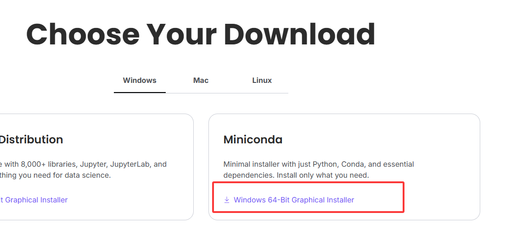

右键以管理员身份运行安装包：

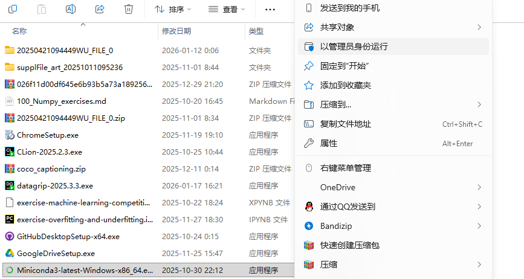

安装类型选择 **Just Me**（仅为当前用户安装）：

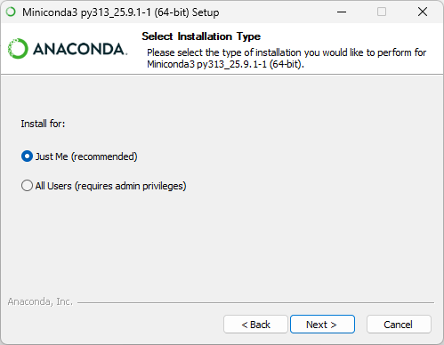

安装路径建议选 D 盘的一个新文件夹。注意：C 盘用户名如果是中文，一定不要装在 C 盘（路径编码问题会导致后续各种报错）。

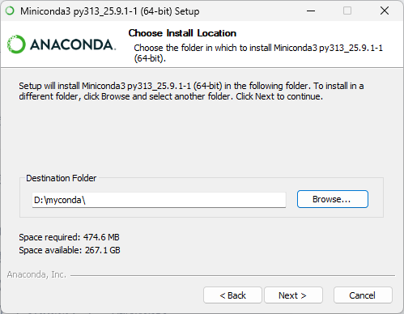

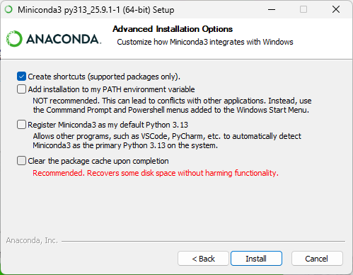

### 配置环境变量

安装完成后，需要将 Conda 添加到系统环境变量，才能在终端中使用 `conda` 命令。

在系统设置中搜索「环境变量」：


点击「环境变量」：

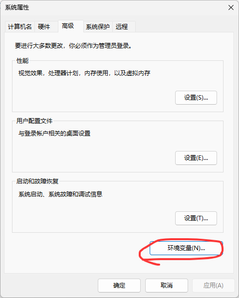

选中 **Path**，点击编辑：

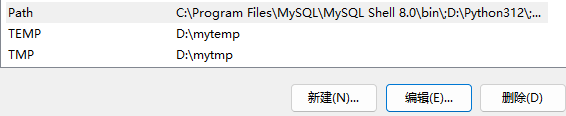

将 Miniconda 安装目录下的 `condabin` 文件夹路径添加到 Path 中（例如 `D:\miniconda3\condabin`）：


### 验证安装

按 `Win + R`，输入 `cmd` 打开终端，输入：

```powershell
conda --version
```

出现版本号就说明安装成功了。

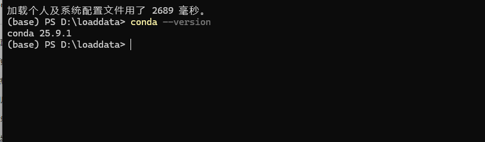

---

## 虚拟环境管理

终端里命令行前面有一个 `(base)`，这表示当前处于 Conda 的基础环境。实际开发中，不同项目可能需要不同的 Python 版本和依赖包——Conda 的虚拟环境正是用来解决这个问题的。你可以把虚拟环境理解为**相互独立的开发空间**。

### 创建环境

创建一个名为 `myenv`、Python 版本为 3.10 的环境：

```powershell
conda create -n myenv python=3.10
```

出现以下提示就创建成功了：

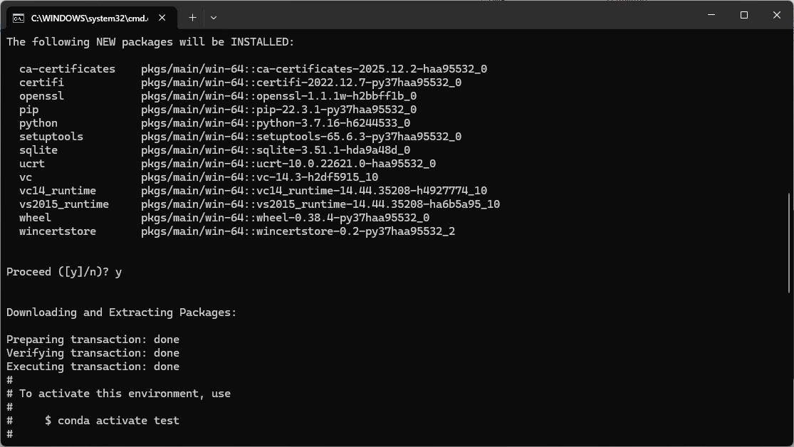

### 激活与退出环境

激活环境：

```powershell
conda activate myenv
```

进入环境后，安装需要的 Python 包：

```powershell
conda install numpy pandas matplotlib scikit-learn seaborn xgboost
```

退出当前环境：

```powershell
conda deactivate
```

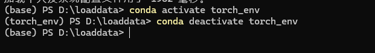

### 删除不需要的环境

```powershell
conda remove -n myenv --all
```

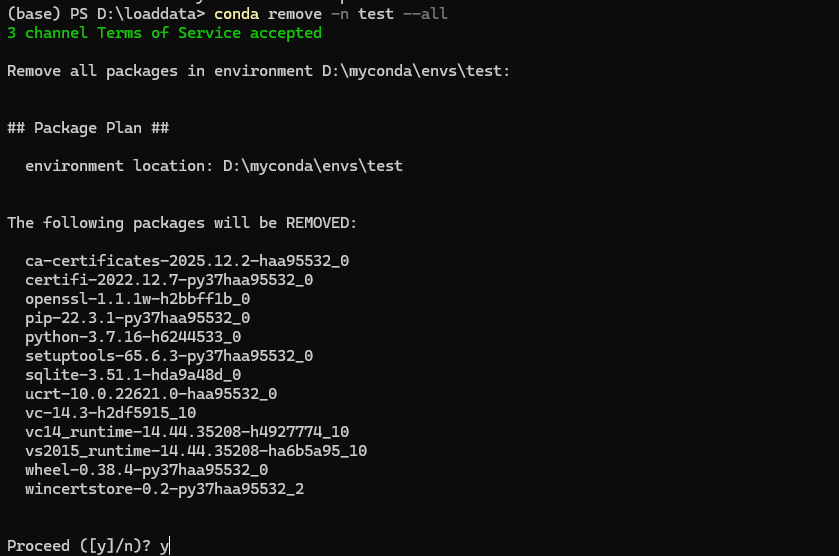

---

## PyTorch 安装

PyTorch 的安装需要根据自己电脑的 GPU 情况来选版本。

首先确认显卡驱动和 CUDA 版本：

```powershell
nvidia-smi
```

关注输出中的 CUDA 版本号：

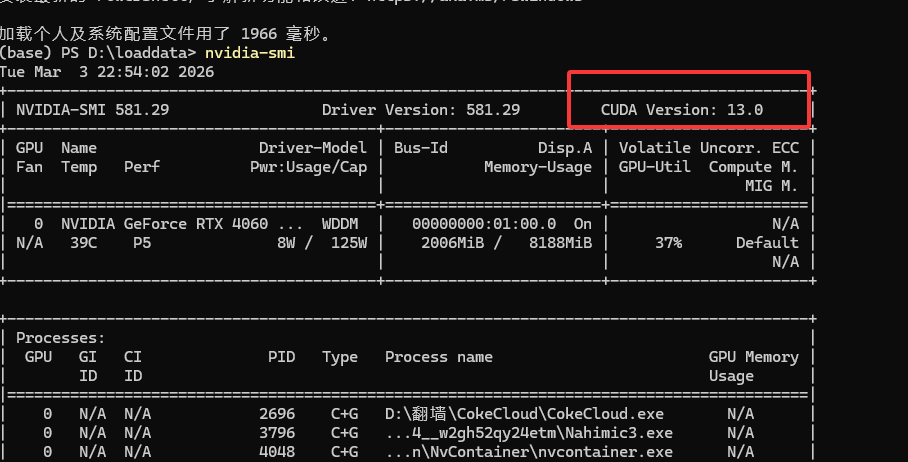

然后到 [PyTorch 官网](https://pytorch.org/get-started/locally/) 选择对应版本，复制安装指令：

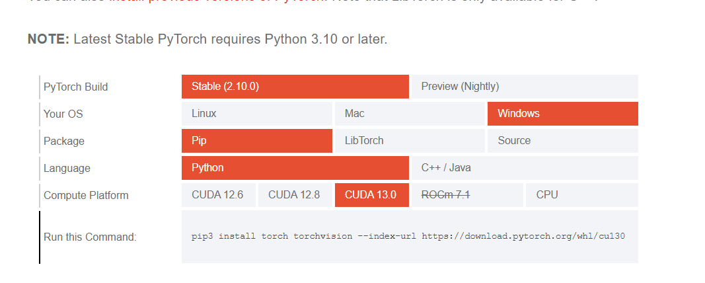

在目标环境中执行（以 CUDA 13.0 为例）：

```powershell
pip3 install torch torchvision --index-url https://download.pytorch.org/whl/cu130
```

如果没有 NVIDIA 显卡，可以前往阿里云领取[免费大学生服务器](https://www.aliyun.com/)，通过 SSH 连接远程服务器进行 GPU 编程。

> Miniconda 官网：[docs.anaconda.com/miniconda](https://docs.anaconda.com/miniconda/)
